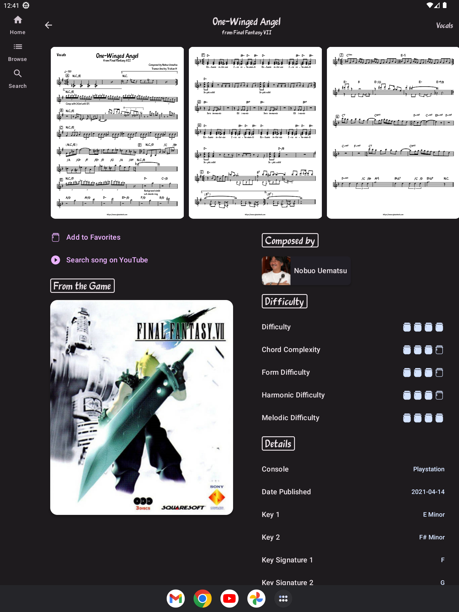

# VGLeadSheets for Android

The mobile companion to the website www.vgleadsheets.com. Offers a mobile-tailored experience for viewing sheet music from video games, designed specifically for jam sessions (both the app and the sheets).

## HD Remaster

VGLeadSheets has been remastered in glorious 4K! Well, not really, that's not a thing with apps. But version 2.0.0 introduces a brand new UI built with Jetpack Compose, support for large displays, a nearly-full rewrite of all features, and numerous performance improvements.

    

## Building

VGLeadSheets should build and install just like any other Android app:

```./gradlew :app:installDebug```
or
```./gradlew :app:installRelease```
